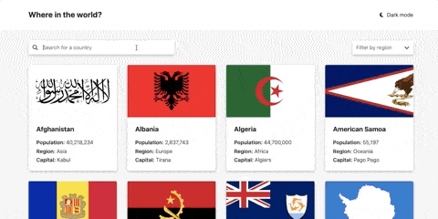
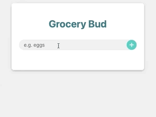
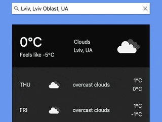

# JavaScript tasks

Several small projects implemented in _JavaScript_ as part of the _"Front End React Developer"_ course

## Comfy 👟

Running shoes catalog with filtering and shopping cart _([website link](https://sashua.github.io/fox-js-ts/task-2-8/index.html))_

## Where in the world 🇺🇦

Get information about countries from [REST countries API](https://restcountries.com), dark theme included _([app link](https://sashua.github.io/fox-js-ts/task-2-7/index.html))_

## Grocery Bud ✅

Just a TODO list _([app link](https://sashua.github.io/fox-js-ts/task-2-6/index.html))_

## Weather widget ⛅️

That's it _([app link](https://sashua.github.io/fox-js-ts/task-2-5/index.html))_

## Other stuff 🗞

- [Create Account](https://sashua.github.io/fox-js-ts/task-2-4/index.html) form validation example
- [Which sorting is the fastest?](https://sashua.github.io/fox-js-ts/task-2-3/index.html)
- [Our Menu](https://sashua.github.io/fox-js-ts/task-2-2/index.html) with filtering
- [Color changer](https://sashua.github.io/fox-js-ts/task-2-1/index.html)

---

